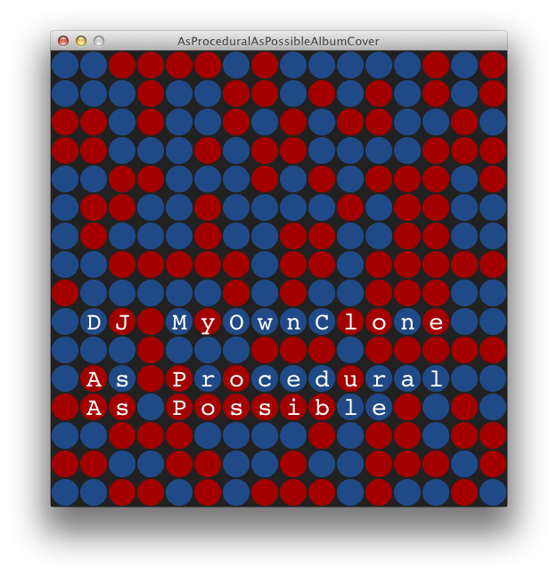
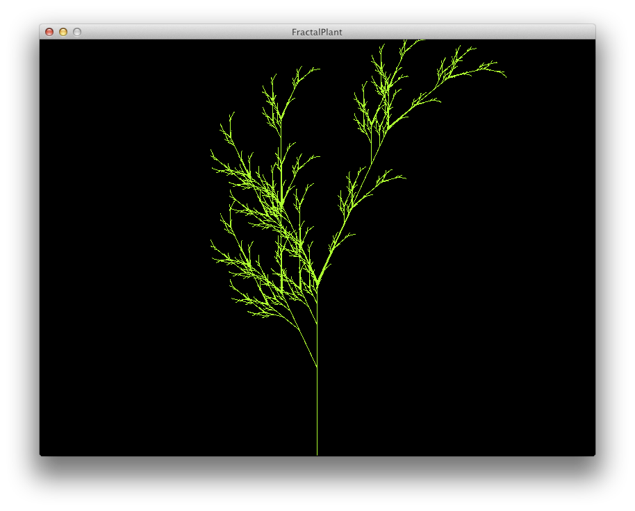
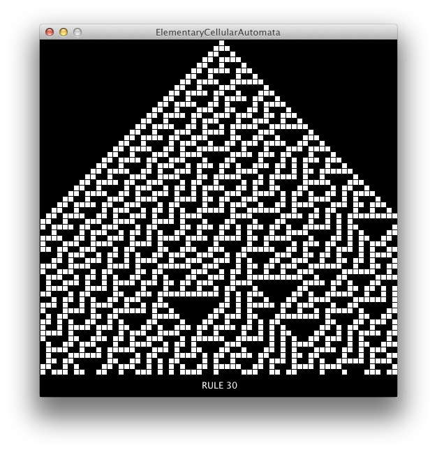
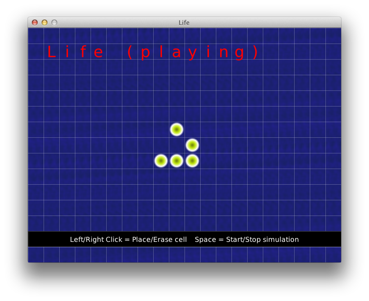
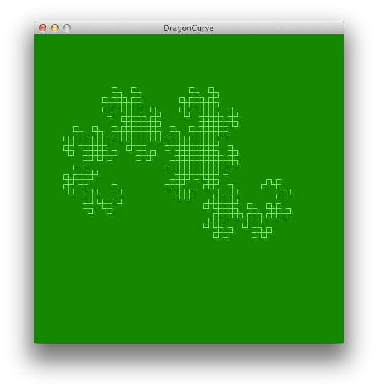
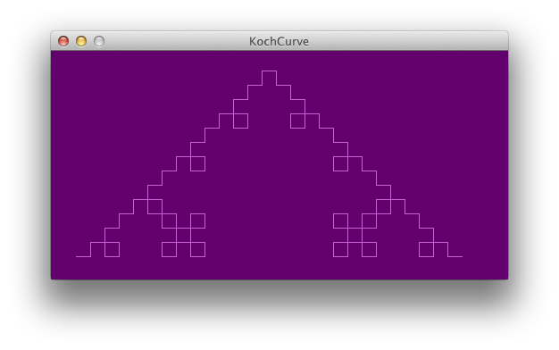
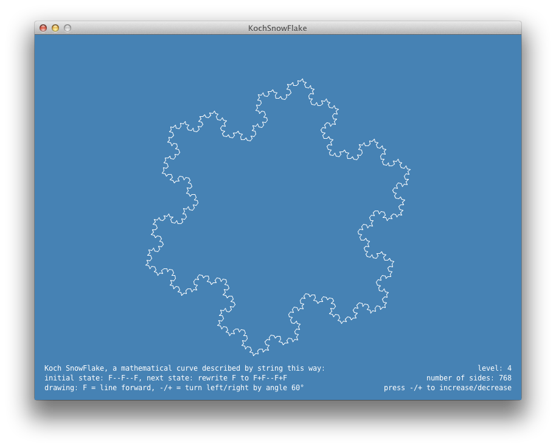

processing-sketches
===================

My sketches for [Processing](http://processing.org) programming language.

There are some sketches in Processing Examples,
which do the same thing, but I created my own slightly fancier version,
just for fun.
I do not expect you to appreciate that. :)

Contents
--------

 * **Cellular Automata**
     * **Elementary Cellular Automata** - 
       One dimensional elementary cellular automata, as described
       by Stephen Wolfram in his book A new kind of science
       (state of cell in next iteration depends on state of cell and its
       left and right neighbour in current iteration,
       thus we have 256 of elementary CAs).
     * **Game Of Life**
 * **L-Systems**
     * **DragonCurve** -
     [Wikipedia](http://en.wikipedia.org/wiki/L-system#Example_7:_Dragon_curve)
     * **FractalPlant** -
     [Wikipedia](http://en.wikipedia.org/wiki/L-system#Example_8:_Fractal_plant)
     * **KochCurve** -  [Wikipedia](http://en.wikipedia.org/wiki/L-system#Example_4:_Koch_curve)
     * **KochSnowFlake**
 * **Other**
     * **AsProceduralAsPossible** - CD cover for album of algorithmically generated music [As Procedural As Possible](http://soundcloud.com/myownclone/sets/as-procedural-as-possible-2/) of a buddy MyOwnClone.

Screenshots
-----------

License
-------

Everything inside this directory is licensed under a
very permissive 2-clause BSD license.
(Detailed text of license is at the beginning of each *.pde file.)

Contact
-------

[oldrich@smehlik.net](mailto:oldrich@smehlik.net)
